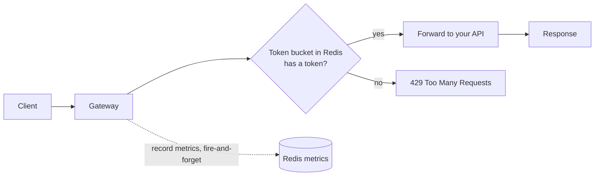
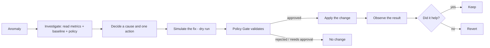

# RateGuard — Autonomous AI Rate Limiting & API Protection Platform

[](https://github.com/Ka4tik3y/rate-gaurd/actions/workflows/ci.yml)

> A system that protects an API from being overwhelmed or abused — and uses an AI agent to tune
> that protection automatically, **safely**, and in a way you can always audit, override, or switch off.

This README is written for someone seeing the project for the first time. It explains, in plain
language, **what the system does, what every term means, how the pieces work together, and why each
piece exists.** Deeper, more technical docs live in [`docs/`](docs/).

---

## 1. What problem does this solve?

Public APIs get hammered — by honest traffic spikes, by buggy clients, and by abusers (scrapers,
credential-stuffing bots, people scanning for vulnerabilities). If you let every request through,
your service falls over. If you clamp down too hard, you block real customers.

**Rate limiting** is the standard defense: cap how many requests each client may make. But a *fixed*
cap is a blunt instrument — it over-blocks real demand and under-reacts to novel abuse.

**RateGuard** keeps a fast, reliable rate limiter in front of your API **and** adds an AI agent that
watches traffic, spots anomalies, and adjusts the limits for you — raising them for legitimate demand,
clamping down on abuse — while a strict safety layer makes sure the AI can never do anything reckless.

**The golden rule:** the rate limiter never depends on the AI. If the agent is turned off or crashes,
the limiter keeps running on its last known settings. The AI is an *enhancement*, never a dependency.

---

## 2. Glossary — every term, in plain English

| Term | What it means | Why it matters |
|---|---|---|
| **API gateway** | A server that sits in front of your real API; every request passes through it first. | One place to enforce rules (like rate limits) for all traffic. |
| **Rate limiting** | Capping how many requests a client can make in a period of time. | Stops any one client from overwhelming the service. |
| **Client** | Whoever is making requests — identified here by IP address. | Limits and anomalies are tracked *per client*. |
| **Token bucket** | The algorithm used to rate-limit. Imagine a bucket that holds up to *N* tokens and refills at a steady rate; each request spends one token; no token → request refused. | Allows short bursts (up to the bucket size) while enforcing a steady average rate — fairer than a hard counter. |
| **Capacity** | The bucket size — the biggest burst a client can make at once. | Bigger = more burst allowed. |
| **Refill rate** | How many tokens are added per second — the sustained request rate allowed. | Sets the long-term allowed throughput. |
| **429** | The HTTP status code "Too Many Requests" — what a client gets when rate-limited. | A 429 means the limiter blocked that request (not an error in your app). |
| **5xx** | HTTP server-error codes (500–599) from the backend service. | High 5xx means *your service* is failing, not that a client is abusing it. |
| **Redis** | A fast in-memory datastore. | Holds the token buckets and traffic counters so multiple gateway copies share one source of truth, with microsecond latency. |
| **Lua script** | A tiny program run *inside* Redis. | Lets the limiter refill-and-consume a token in one atomic step, so two gateways can’t double-spend the same token. |
| **Anomaly** | Traffic that deviates from normal (a sudden spike, a flood of 429s, endpoint scanning, a 5xx storm). | The trigger that wakes the AI agent. |
| **EWMA / z-score** | Cheap statistics. EWMA = a rolling average that weights recent data more; z-score = how many standard deviations the current value is from that average. | Lets the system flag "unusually high" without any AI — fast and free. |
| **Policy** | The rate-limit settings for a client (capacity + refill rate), or a temporary block. | What the agent/admin actually changes. |
| **Policy Gate** | A guarded checkpoint that **every** policy change must pass through. | The safety layer: it validates, bounds, audits, and can reject any change — this is what makes the AI safe to run. |
| **Guardrail** | A hard limit on what a change may do (e.g. "never change a limit by more than ±50%"). | The AI (or a buggy admin) literally cannot exceed these. |
| **Kill switch** | A single global on/off switch for all autonomous AI actions. | Instant "stop the AI" button; the limiter keeps working. |
| **Audit log** | A permanent record of every anomaly, decision, and action. | Accountability — you can always see *what* changed, *why*, and *who/what* did it. |
| **AI agent** | The autonomous program that investigates anomalies and proposes actions. | Does the tuning a human would otherwise do manually, 24/7. |
| **LLM** | Large Language Model (e.g. Claude) — the "reasoning" brain the agent can use. | Optional: explains causes and picks actions. The agent also works without one, using fixed rules. |
| **Heuristic planner** | A deterministic rule-set the agent uses when no LLM key is configured. | The whole system runs and is testable with **no API key and no cost**. |
| **Closed loop** | Act → measure the result → keep it if it helped, undo it if it didn’t. | The agent verifies its own work and automatically rolls back mistakes. |
| **Simulation (dry run)** | Replaying recent traffic against a proposed limit *without changing anything*. | "What would happen if…?" — lets the agent check a change before making it. |
| **Backend-for-frontend (BFF)** | A small server that sits between the dashboard and the core services. | Keeps admin passwords off the browser and turns per-client APIs into the views the dashboard needs. |

---

## 3. The services — what each one is and the benefit it provides

RateGuard is five cooperating pieces (plus Redis and a test echo server). Each runs in its own
container.

| Service | What it is | What it does | Benefit it provides | Port |
|---|---|---|---|---|
| **rate-limiter** (Java / Spring Cloud Gateway) | The API gateway on the request hot path. | Resolves the client, applies the token-bucket limit (via Redis+Lua), forwards allowed requests to your API, returns `429` otherwise; records traffic metrics; runs the deterministic anomaly detector. | Fast, reliable protection that works **on its own**, independent of the AI. | 8080 |
| **ai-agent** (Python / FastAPI / LangGraph) | The autonomous operator, off the hot path. | Investigates an anomaly, inspects metrics, simulates a fix, proposes an action, and verifies the outcome. | Automates limit tuning and abuse response; explains its reasoning; reverts its own mistakes. | 8000 |
| **Policy Gate** (inside rate-limiter) | The single validated path for changes. | Checks every proposed change against guardrails, enforces the kill switch and human approval, applies it, and writes the audit entry. | Makes autonomous action **safe** — the AI can never touch settings directly or exceed limits. | — |
| **dashboard** (BFF + React UI) | The web control panel. | Serves the UI and aggregates the real services into live views; lets you generate test traffic and trigger investigations. | A single place to **see and test** the whole system without the command line. | 8090 |
| **redis** | In-memory datastore. | Stores token buckets, per-client metrics, policy overrides/blocks, and the kill-switch flag. | Shared, microsecond-fast state so the limiter scales horizontally. | 6379 |
| **httpbin** | A local echo server. | Stands in for "your real API" as the forwarding target. | Lets you demo safely without sending traffic to the public internet. | internal |

---

## 4. How it works

### 4a. A normal request (the fast path)



Every request hits the **gateway**. The gateway asks the **token bucket** (one atomic Lua call in
Redis): *does this client have a token?* If yes, the request is forwarded and a token is spent; if
no, the client gets a **429**. Traffic is recorded to Redis "fire-and-forget" — recording can never
slow down or break the actual limit decision. If Redis is unreachable, the limiter follows a
configured fail mode (fail-open = allow, fail-closed = block).

### 4b. When something looks wrong (the smart path)

A scheduled sweep aggregates each client's recent traffic and runs **deterministic** detectors
(EWMA/z-score + threshold rules — no AI, so it’s cheap and always on). When a threshold is crossed,
it emits an **anomaly**. The **AI agent** then runs this loop:



The agent only ever **proposes**; the **Policy Gate** decides. The possible actions are limited to:
*adjust a limit*, *temporarily block a client*, or *raise an alert*.

### 4c. The safety layer (why you can trust the AI)

Every change — whether from the AI or a human admin — passes the **Policy Gate**, which enforces, in
order:

1. **Kill switch** — if autonomous actions are off, AI changes are rejected (alerts still flow).
2. **Evidence** — the anomaly must be strong enough to act on.
3. **Bounds & the ±50% cap** — a limit can’t be changed by more than ±50% automatically, and never
   outside absolute min/max.
4. **Cooldown & rate cap** — no rapid-fire changes to the same client.
5. **Human approval** — blocking a *high-value* client is never automatic; it waits for a person.

Every attempt is written to the **audit log** (what was proposed, the evidence, the decision, the
before/after values). Nothing — AI or otherwise — can reach Redis except through this gate.

---

## 5. The dashboard

Open **http://localhost:8090** after starting the stack (below). It’s a read-and-control panel:

- **Overview** — live request volume, allowed vs rate-limited, active anomalies, KPIs.
- **Test Console** — *generate traffic* as a client and watch it get rate-limited; *trigger an
  investigation* and watch the agent decide → gate → act → verify.
- **Clients / Traffic / Policies** — per-client metrics, limits, and risk.
- **Agent / Investigations / Policy Gate** — what the AI did, each investigation’s full workflow, and
  the guardrails + recent decisions.
- **Simulation** — dry-run a proposed limit against real recent traffic.
- **Audit / Evaluation / Health** — the record of events, static-vs-adaptive results, and service
  status (including a demo of "agent offline, limiter still healthy").

The dashboard talks only to a small **BFF**, which holds the admin credentials server-side — they are
never exposed to the browser.

---

## 6. Quick start

**Prerequisites:** Docker (and Docker Compose). Nothing else needed — no Java, Node, Python, or API key.

```bash
docker compose up --build
```

That starts everything: `redis`, `rate-limiter` (:8080), `ai-agent` (:8000), `dashboard` (:8090), and
a local `httpbin` echo target. Then:

- Open the dashboard: **http://localhost:8090**
- Or hit the gateway directly: `curl -H "X-Forwarded-For: me" http://localhost:8080/api/get`

By default the AI uses the **deterministic heuristic planner** (no API key, no cost). To use Claude
instead, set `ANTHROPIC_API_KEY` in your environment before `up`.

> **Credentials:** the admin/agent logins default to `admin/admin` and `agent/agent`. These are
> **development placeholders** — override them with environment variables for any real use.

---

## 7. Try it (2 minutes)

1. Go to **Test Console** → **Generate traffic** for `demo-1` with ~200 requests. You’ll see some
   **allowed** and some **429** (the bucket ran out) — that’s the limiter working.
2. Go to **Test Console** → **Trigger an investigation** for `demo-1` (anomaly type *Sustained 429s*).
   The agent investigates and (because traffic is steady, not bursty) proposes **raising the limit**,
   the **Policy Gate** approves it, and the agent **verifies** the result.
3. Check **Investigations** for the full step-by-step workflow, **Policy Gate** for the decision, and
   **Audit** for the permanent record.
4. Flip the **kill switch** on the Agent page and trigger again — the gate now **rejects** the AI’s
   change, while traffic keeps flowing. That’s the safety guarantee in action.

---

## 8. Project layout

| Folder | What’s in it |
|---|---|
| [`rate-limiter/`](rate-limiter/) | The Java gateway: token-bucket limiter, metrics, anomaly detector, Policy Gate, admin API, audit log, kill switch. |
| [`ai-agent/`](ai-agent/) | The Python agent: LangGraph investigation workflow, tools, LLM/heuristic planners, and the Phase 5 offline simulation + evaluation harness (`app/simulation/`). |
| [`dashboard-bff/`](dashboard-bff/) | The FastAPI backend-for-frontend that serves the UI and bridges it to the real services. |
| [`frontend/`](frontend/) | The React + TypeScript dashboard UI. |
| [`evaluation/`](evaluation/) | Traffic scenarios and measured static-vs-adaptive results. |
| [`load-tests/`](load-tests/) | k6 load-test scenarios for the limiter. |
| [`docs/`](docs/) | Deep-dive docs (below). |

---

## 9. Deeper documentation

- [docs/architecture.md](docs/architecture.md) — the whole system, request flow, component responsibilities.
- [docs/rate-limiter.md](docs/rate-limiter.md) — the token bucket, Redis layout, failure modes, config.
- [docs/agent.md](docs/agent.md) — the agent workflow, tools, closed loop, LLM provider.
- [docs/security.md](docs/security.md) — roles, the Policy Gate, kill switch, approvals, audit, secrets.
- [docs/evaluation.md](docs/evaluation.md) — how we measure that the AI actually helps.
- [docs/api-contract.md](docs/api-contract.md) — the API the dashboard expects from the backend.

---

## 10. How it was built (phases)

The system was built in five tested phases, each self-contained:

1. **Phase 1** — the Redis-backed token-bucket rate limiter (the standalone fast path).
2. **Phase 2** — traffic metrics + the cheap, deterministic anomaly detector (no AI).
3. **Phase 3** — dynamic per-client limits, the Policy Gate, admin API, audit log, kill switch (the safety layer).
4. **Phase 4** — the autonomous Python/LangGraph AI agent that investigates and acts through the gate.
5. **Phase 5** — an offline simulation + evaluation harness that *measures* static vs AI-assisted limiting.

(The dashboard and its BFF were added on top to make the whole system usable and testable from a browser.)

### A note on the toolchain
The frontend is built on **Node 20 LTS** (inside Docker). If you build it directly on a machine with
Node 25+, the bundler can hang — use Node 20/22 or the provided Docker build.
