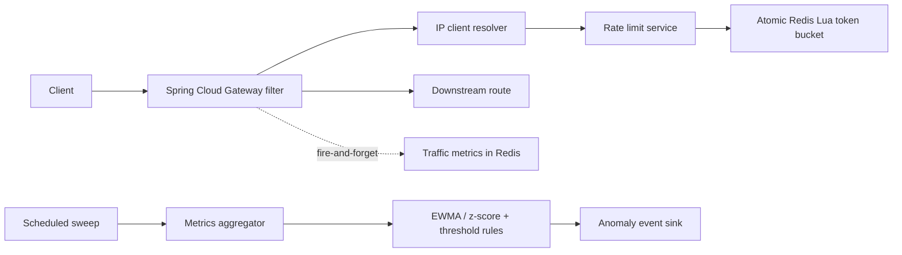
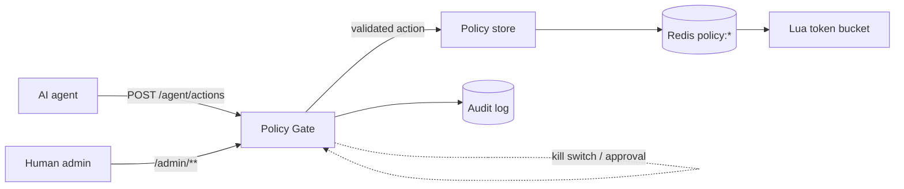
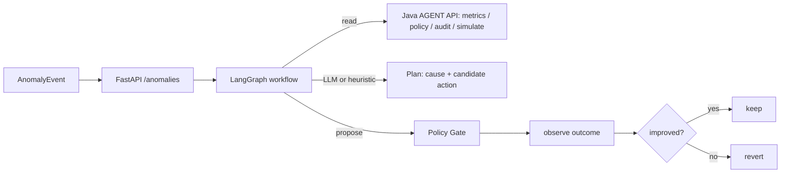

# Autonomous AI Rate Limiting & API Protection Platform

**Phase 1** implements the independently deployable, Redis-backed gateway rate limiter.
**Phase 2** adds aggregated traffic metrics and a cheap, deterministic anomaly detector (no LLM).
**Phase 3** adds dynamic per-client limits, a guardrailed Policy Gate, admin API, audit log, and kill switch.
**Phase 4** adds the autonomous Python/LangGraph AI agent that investigates anomalies and acts through the gate.
The rate limiter never depends on the AI — if the agent is down, limiting continues on the static policy.



Each `rl:bucket:{default}:{clientId}` Redis hash holds `tokens` and `timestamp`. One Lua invocation uses Redis server time, refills and caps the bucket, consumes a token if available, sets expiry, and returns the decision atomically. This permits multiple gateway instances to share exactly one bucket.

## Run

```powershell
docker compose up --build
```

Or start Redis locally, then:

```powershell
cd rate-limiter
mvn clean test
mvn clean package
mvn spring-boot:run
```

The sample `/api/**` gateway route forwards to `DOWNSTREAM_URL` (default `http://httpbin.org`). Configure `RATE_LIMIT_DEFAULT_CAPACITY`, `RATE_LIMIT_DEFAULT_REFILL_RATE`, `RATE_LIMIT_ENABLED`, and `RATE_LIMIT_REDIS_FAILURE_MODE` (`FAIL_OPEN` or `FAIL_CLOSED`) through environment variables.

## Load tests

Install [k6](https://grafana.com/docs/k6/latest/set-up/install-k6/) and run one scenario from `load-tests/scenarios`, e.g. `k6 run load-tests/scenarios/same-client-contention.js`. The scenarios report request throughput, latency, and 429s. They expect the gateway on port 8080.

Metrics are exposed by Actuator at `/actuator/prometheus`: `rate_limit_requests_total`, `rate_limit_allowed_total`, `rate_limit_rejected_total`, `rate_limit_redis_errors_total`, and `rate_limit_latency`. Tags are bounded to policy and result only — endpoint and client identifiers are deliberately kept out of Micrometer to avoid high-cardinality tag explosion; per-endpoint/per-client detail lives in the aggregated Redis traffic metrics (Phase 2) instead.

## Phase 2 — traffic metrics & deterministic anomaly detection

On every `/api/**` request the gateway records an outcome (requests, 429s, 5xx, latency, endpoint) into Redis **fire-and-forget**, so metric collection can never slow or break the rate-limit decision. State lives under the `metric:*` namespace, entirely separate from the `rl:*` rate-limit state, and is aggregated into per-minute buckets with a TTL — no request is stored forever.

- `metric:req:{clientId}:{minute}` — hash of `requests` / `rate_limited` / `errors` / `latency_ms`
- `metric:endpoints:{clientId}:{minute}` — HyperLogLog of distinct endpoints (union via `PFCOUNT`)
- `metric:active` — sorted set of clients by last-seen second, used to find who to evaluate

A scheduled sweep (default every 60s, off the request hot path) aggregates each active client's recent traffic into **1/5/10-minute windows** — request rate, 429 ratio, error ratio, average latency, unique endpoints, and burstiness (peak-minute / mean-minute) — and runs two deterministic strategies:

- **EWMA + z-score** baseline detector for request-rate spikes (flags upward deviations past a z-score threshold after a warm-up period).
- **Threshold rules** for conditions anomalous in absolute terms: 429 surge, 5xx surge, burstiness, and slow-and-low endpoint scanning (low rate but wide endpoint spread). Ratio rules require a minimum sample size to avoid small-sample noise.

Crossing a threshold emits an `AnomalyEvent` (clientId, metric, current value, baseline, deviation, severity, window, reason) to an `AnomalyEventSink` — a bounded in-memory buffer plus a structured log line. No LLM is involved; the detector only "wakes" on meaningful thresholds. Phase 4's AI agent will consume these events.

Tuning lives under `anomaly:` / `traffic-metrics:` in `application.yml`, all overridable by environment variable (e.g. `ANOMALY_INTERVAL_SECONDS`, `ANOMALY_EVALUATION_WINDOW_MINUTES`, `ANOMALY_REJECT_RATIO_THRESHOLD`, `TRAFFIC_METRICS_ENABLED`).

## Phase 3 — Policy Gate, Admin API, audit log & kill switch

Phase 3 makes limits dynamic and adds the safety layer that will let an AI agent (Phase 4) act without ever touching Redis directly. Limits are now per-client: the token-bucket Lua script atomically reads a `policy:override:{clientId}` and a `policy:block:{clientId}` key, so an adjusted limit or a temporary block takes effect on the very next request — and if every higher layer is down, the limiter still runs on its defaults.



**Policy Gate (§20–24)** is the single validated path for every mutation. The only actions are `ADJUST_LIMIT`, `TEMPORARY_BLOCK`, and `ALERT`. For an agent action it enforces, in order: the **kill switch** (agent mutations disabled ⇒ rejected; alerts still flow), an **evidence threshold**, **absolute** capacity bounds and the **±50% automatic-change** cap, a **cooldown**, and a **max-actions-per-window** cap. A `TEMPORARY_BLOCK` of a **HIGH_VALUE** client is never executed automatically — it is held as **PENDING_APPROVAL** until a human approves it. Human admin actions share the same path (and audit) but may exceed the agent-only ±50% cap. Nothing — agent or otherwise — can reach Redis except through this gate.

**Audit log (§25):** every attempt is recorded in Redis (`audit:{clientId}` + `audit:all`) with the trigger, evidence, proposal, gate decision, previous vs applied values (for rollback), and execution result — a concise rationale, never model chain-of-thought.

**Admin API (§35)** is secured with Spring Security HTTP Basic (§34): `/admin/**` requires the `ADMIN` role, the agent's `/agent/actions` requires `AGENT`, while `/api/**` and `/actuator/health` stay public.

| Method & path | Role | Purpose |
|---|---|---|
| `GET /admin/rate-limits/{clientId}` | ADMIN | effective limit, block status, classification |
| `PUT /admin/rate-limits/{clientId}` | ADMIN | set a limit (via the gate) |
| `POST /admin/rate-limits/{clientId}/block` · `/unblock` | ADMIN | block / unblock |
| `POST /admin/rate-limits/{clientId}/simulate` | ADMIN | dry-run a limit against recent traffic (read-only) |
| `PUT /admin/rate-limits/{clientId}/classification` | ADMIN | set NORMAL / HIGH_VALUE |
| `GET /admin/metrics/{clientId}` | ADMIN | windowed traffic metrics |
| `GET /admin/audit/{clientId}` | ADMIN | audit trail |
| `POST /admin/agent/kill-switch` · `GET /admin/agent/status` | ADMIN | toggle / inspect the kill switch |
| `GET /admin/agent/pending` · `POST /admin/agent/pending/{id}/approve` · `/reject` | ADMIN | high-value approval queue |
| `POST /agent/actions` | AGENT | the agent proposes an action (always gated) |

Credentials and guardrails are configured under `admin.security:` / `policy-gate:` / `agent:` in `application.yml`, all env-overridable (`ADMIN_USERNAME`/`ADMIN_PASSWORD`, `AGENT_USERNAME`/`AGENT_PASSWORD`, `POLICY_GATE_MAX_CHANGE_RATIO`, `AGENT_ENABLED`, …). **The default credentials are dev-only placeholders — override them in any real deployment.**

Example — an agent proposes a limit change, which the gate validates and applies:

```bash
curl -u agent:agent -X POST localhost:8080/agent/actions -H 'Content-Type: application/json' -d '{
  "actionType":"ADJUST_LIMIT","clientId":"203.0.113.9","newCapacity":140,"newRefillRate":14,
  "trigger":"request_rate_anomaly","reason":"sustained spike",
  "evidence":{"metric":"request_rate","currentValue":420,"baseline":80,"deviation":4.2,"severity":"HIGH","window":"5m"}}'
```

## Phase 4 — the autonomous AI agent (Python / FastAPI / LangGraph)

`ai-agent/` is a separate, independently deployable service. It is strictly off the request hot path: if it is down, the Java rate limiter keeps working on its static policy (architectural rules 1 & 12). It reaches the Java side only over HTTP using the **AGENT** role, so it can read context and propose actions but can never touch Redis or an admin endpoint — every mutation goes through `POST /agent/actions` → Policy Gate (rules 2–4).



**LangGraph state machine (§27):** inspect metrics → inspect baseline → inspect policy → determine cause → generate action → simulate → validate → **policy gate** → observe outcome → evaluate outcome → **keep / revert** → finalize. The closed loop (§30–31) re-reads metrics after an adjustment, compares the 429 ratio before vs after, and automatically **reverts** a change that made things worse.

**Tools (§28):** `get_client_metrics`, `get_historical_metrics`, `get_current_policy`, `get_client_classification`, `get_action_history`, `simulate_policy_change`, `propose_rate_limit_change`, `propose_temporary_block`, `send_alert` — the `propose_*`/`send_alert` tools all call the gate; none touch Redis.

**LLM provider abstraction:** `AGENT_LLM_PROVIDER=auto` uses **Claude** (`AGENT_ANTHROPIC_MODEL`, default `claude-opus-5-5`) when `ANTHROPIC_API_KEY` is set, otherwise a **deterministic heuristic planner** so the whole agent runs and is fully testable with no API key. If the LLM call fails or returns malformed output, the agent takes **no action** (the static policy stands, §24).

Run it:

```bash
# whole stack (rate limiter + redis + agent)
docker compose up --build        # agent on :8000, gateway on :8080

# or locally
cd ai-agent && python -m venv .venv && . .venv/bin/activate
pip install -r requirements.txt
uvicorn app.main:app --port 8000
pytest                            # 13 tests, no network / no API key needed

# hand the agent an anomaly to investigate
curl -X POST localhost:8000/anomalies -H 'Content-Type: application/json' -d '{
  "clientId":"203.0.113.9","metric":"reject_ratio","deviation":4.2,"severity":"HIGH",
  "window":"5m","reason":"sustained 429s with steady traffic"}'
```
