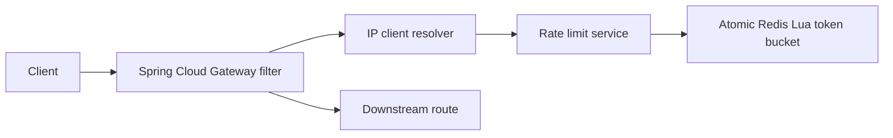

# Autonomous AI Rate Limiting & API Protection Platform

Phase 1 implements the independently deployable, Redis-backed gateway rate limiter. Later AI and anomaly-detection phases are deliberately not present.



Each `rl:bucket:{default}:{clientId}` Redis hash holds `tokens` and `timestamp`. One Lua invocation uses Redis server time, refills and caps the bucket, consumes a token if available, sets expiry, and returns the decision atomically. This permits multiple gateway instances to share exactly one bucket.

## Run

```powershell
docker compose up --build
```

Or start Redis locally, then:

```powershell
cd rate-limiter
mvn clean test
mvn clean package
mvn spring-boot:run
```

The sample `/api/**` gateway route forwards to `DOWNSTREAM_URL` (default `http://httpbin.org`). Configure `RATE_LIMIT_DEFAULT_CAPACITY`, `RATE_LIMIT_DEFAULT_REFILL_RATE`, `RATE_LIMIT_ENABLED`, and `RATE_LIMIT_REDIS_FAILURE_MODE` (`FAIL_OPEN` or `FAIL_CLOSED`) through environment variables.

## Load tests

Install [k6](https://grafana.com/docs/k6/latest/set-up/install-k6/) and run one scenario from `load-tests/scenarios`, e.g. `k6 run load-tests/scenarios/same-client-contention.js`. The scenarios report request throughput, latency, and 429s. They expect the gateway on port 8080.

Metrics are exposed by Actuator at `/actuator/prometheus`: `rate_limit_requests_total`, `rate_limit_allowed_total`, `rate_limit_rejected_total`, `rate_limit_redis_errors_total`, and `rate_limit_latency`. Tags are policy, endpoint, and result; no client identifiers are metric tags.
