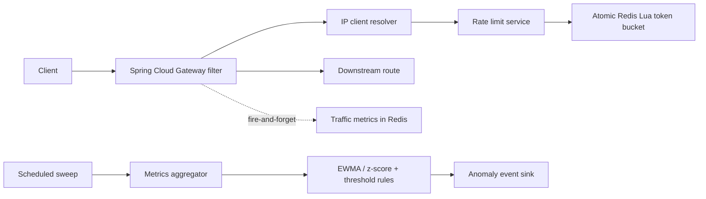

# Autonomous AI Rate Limiting & API Protection Platform

**Phase 1** implements the independently deployable, Redis-backed gateway rate limiter.
**Phase 2** adds aggregated traffic metrics and a cheap, deterministic anomaly detector (no LLM).
Later AI phases are deliberately not present — the rate limiter never depends on them.



Each `rl:bucket:{default}:{clientId}` Redis hash holds `tokens` and `timestamp`. One Lua invocation uses Redis server time, refills and caps the bucket, consumes a token if available, sets expiry, and returns the decision atomically. This permits multiple gateway instances to share exactly one bucket.

## Run

```powershell
docker compose up --build
```

Or start Redis locally, then:

```powershell
cd rate-limiter
mvn clean test
mvn clean package
mvn spring-boot:run
```

The sample `/api/**` gateway route forwards to `DOWNSTREAM_URL` (default `http://httpbin.org`). Configure `RATE_LIMIT_DEFAULT_CAPACITY`, `RATE_LIMIT_DEFAULT_REFILL_RATE`, `RATE_LIMIT_ENABLED`, and `RATE_LIMIT_REDIS_FAILURE_MODE` (`FAIL_OPEN` or `FAIL_CLOSED`) through environment variables.

## Load tests

Install [k6](https://grafana.com/docs/k6/latest/set-up/install-k6/) and run one scenario from `load-tests/scenarios`, e.g. `k6 run load-tests/scenarios/same-client-contention.js`. The scenarios report request throughput, latency, and 429s. They expect the gateway on port 8080.

Metrics are exposed by Actuator at `/actuator/prometheus`: `rate_limit_requests_total`, `rate_limit_allowed_total`, `rate_limit_rejected_total`, `rate_limit_redis_errors_total`, and `rate_limit_latency`. Tags are bounded to policy and result only — endpoint and client identifiers are deliberately kept out of Micrometer to avoid high-cardinality tag explosion; per-endpoint/per-client detail lives in the aggregated Redis traffic metrics (Phase 2) instead.

## Phase 2 — traffic metrics & deterministic anomaly detection

On every `/api/**` request the gateway records an outcome (requests, 429s, 5xx, latency, endpoint) into Redis **fire-and-forget**, so metric collection can never slow or break the rate-limit decision. State lives under the `metric:*` namespace, entirely separate from the `rl:*` rate-limit state, and is aggregated into per-minute buckets with a TTL — no request is stored forever.

- `metric:req:{clientId}:{minute}` — hash of `requests` / `rate_limited` / `errors` / `latency_ms`
- `metric:endpoints:{clientId}:{minute}` — HyperLogLog of distinct endpoints (union via `PFCOUNT`)
- `metric:active` — sorted set of clients by last-seen second, used to find who to evaluate

A scheduled sweep (default every 60s, off the request hot path) aggregates each active client's recent traffic into **1/5/10-minute windows** — request rate, 429 ratio, error ratio, average latency, unique endpoints, and burstiness (peak-minute / mean-minute) — and runs two deterministic strategies:

- **EWMA + z-score** baseline detector for request-rate spikes (flags upward deviations past a z-score threshold after a warm-up period).
- **Threshold rules** for conditions anomalous in absolute terms: 429 surge, 5xx surge, burstiness, and slow-and-low endpoint scanning (low rate but wide endpoint spread). Ratio rules require a minimum sample size to avoid small-sample noise.

Crossing a threshold emits an `AnomalyEvent` (clientId, metric, current value, baseline, deviation, severity, window, reason) to an `AnomalyEventSink` — a bounded in-memory buffer plus a structured log line. No LLM is involved; the detector only "wakes" on meaningful thresholds. Phase 4's AI agent will consume these events.

Tuning lives under `anomaly:` / `traffic-metrics:` in `application.yml`, all overridable by environment variable (e.g. `ANOMALY_INTERVAL_SECONDS`, `ANOMALY_EVALUATION_WINDOW_MINUTES`, `ANOMALY_REJECT_RATIO_THRESHOLD`, `TRAFFIC_METRICS_ENABLED`).
