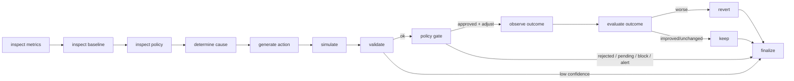
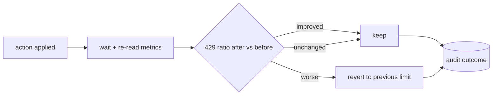

# AI agent

A separate Python/FastAPI service that investigates a traffic anomaly for one client and takes at
most one safe, constrained action through the Policy Gate — then verifies the outcome and rolls back
a regression. It is strictly off the request hot path (architectural rules 1 & 12) and holds only
the **AGENT** role, so it can read context and propose actions but can never touch Redis or an admin
endpoint.

## Workflow (LangGraph state machine, §27)

Only the **cause + candidate action** come from the planner; everything else — metrics, simulation,
the gate, outcome verification, rollback — is deterministic code.

## Closed-loop outcome check (§30–31)

After an applied limit change the agent re-reads metrics, compares the 429 ratio before vs after,
and classifies the result:

The agent evaluates on **the window the detector fired on** (not a fixed config window), so a short
recent burst is not mis-read as abuse through a window-inflated burstiness metric.

## Tools (§28)

Read: `get_client_metrics`, `get_historical_metrics`, `get_current_policy`,
`get_client_classification`, `get_action_history`, `simulate_policy_change`. Mutate (all via the
gate): `propose_rate_limit_change`, `propose_temporary_block`, `send_alert`. No tool touches Redis
or an admin endpoint.

## Decision logic

The planner chooses one of `ADJUST_LIMIT`, `TEMPORARY_BLOCK`, `ALERT`, `NONE`:

| Signal | Decision |
|---|---|
| High 5xx ratio | `ALERT` (server-side; throttling the client would not help) |
| Slow-and-low (low rate, wide endpoint spread) | `TEMPORARY_BLOCK` |
| Bursty + heavily rejected | `TEMPORARY_BLOCK` |
| Sustained 429s, steady (non-bursty) traffic | `ADJUST_LIMIT` up (limit too tight) |
| Otherwise ambiguous | `ALERT` / `NONE` |

## LLM provider abstraction

`AGENT_LLM_PROVIDER=auto` uses **Claude** (`AGENT_ANTHROPIC_MODEL`, default `claude-opus-5-5`) when
`ANTHROPIC_API_KEY` is set, otherwise a **deterministic heuristic planner** so the whole agent runs
and is fully testable with no API key. On any LLM/parse failure the agent takes **no action** — the
static policy stands (§24). The agent stores a concise rationale, never model chain-of-thought.

## API

- `GET /health` — status + resolved provider.
- `POST /anomalies` — hand the agent an `AnomalyEvent` to investigate; returns the full decision,
  gate result, simulation, outcome, and the step trace.
