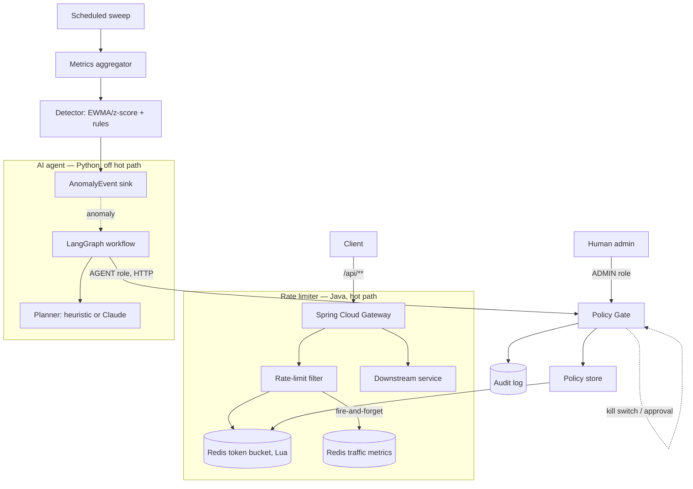
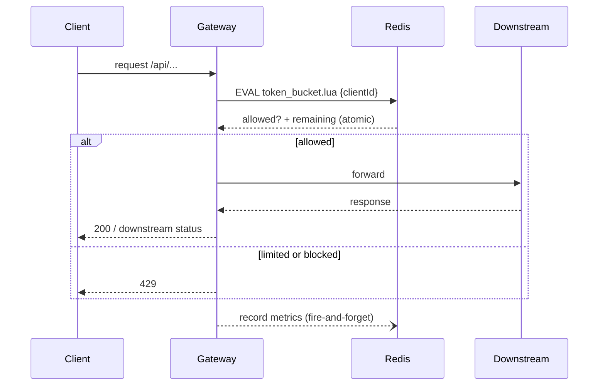

# Architecture

An autonomous API rate-limiting and protection platform in two independently deployable parts: a
**Java/Spring Cloud Gateway rate limiter** on the request hot path, and a **Python/LangGraph AI
agent** off it. The agent can only *propose* changes; it reaches the Java side over HTTP with a
restricted role and never touches Redis or production config directly.

## System architecture

## Request flow (hot path)

The metric write is fire-and-forget, so metric collection can never slow or break a rate-limit
decision. If Redis is unreachable the limiter follows `RATE_LIMIT_REDIS_FAILURE_MODE`
(`FAIL_OPEN` / `FAIL_CLOSED`).

## Components

| Component | Tech | Responsibility |
|---|---|---|
| Gateway + filter | Spring Cloud Gateway (WebFlux) | Resolve the client, apply the limit, forward or 429. |
| Token bucket | Redis + Lua | Atomic refill/consume with per-client overrides and blocks. |
| Traffic metrics | Redis (`metric:*`) | Per-minute counts, 429/5xx ratios, unique endpoints. |
| Detector | Java service, scheduled | Deterministic EWMA/z-score + threshold rules → `AnomalyEvent`. |
| Policy Gate | Java service | The single validated path for every mutation (guardrails + audit). |
| Admin API | Spring Security (HTTP Basic) | Human operations; approval queue; kill switch. |
| AI agent | Python / FastAPI / LangGraph | Investigate anomalies, propose gated actions, verify outcomes. |
| Evaluation harness | Python (offline) | Static vs adaptive comparison over replayed scenarios. |

## Architectural rules (§41)

1. The rate limiter never depends on the AI — if the agent is down, limiting continues on the
   static policy.
2. The LLM never accesses Redis directly.
3. The LLM never mutates production config directly.
4. Every mutation goes through the Policy Gate.
5. Every autonomous action is auditable.
6. High-risk actions (e.g. blocking a high-value client) require human approval.
7. The agent simulates before acting when appropriate.
8. The agent verifies outcomes and rolls back regressions.
9. There is a global kill switch.

See [rate-limiter.md](rate-limiter.md), [agent.md](agent.md), [security.md](security.md),
[evaluation.md](evaluation.md).
