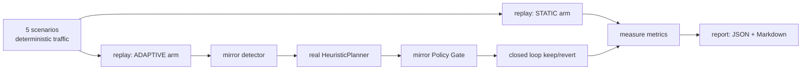

# Evaluation methodology

Phase 5 answers one question with measurements, not assertions (§33):

> Does the adaptive system improve protection **without** unnecessarily blocking legitimate clients?

## Pipeline



Both arms replay the **same** request stream, so the only variable is the policy. The adaptive arm
drives the real agent planner through a faithful offline mirror of the Phase 2 detector, the Phase 3
Policy Gate, and the Phase 4 closed loop. See [`evaluation/`](../evaluation/README.md).

## Why offline and deterministic

- **Same traffic under both policies** — a live stack cannot replay identical requests; an offline
  replay can, which is the only fair A/B.
- **Reproducible** — no Redis, no network, no API key; runs in CI in ~2s.
- **Faithful** — the token bucket mirrors `token_bucket.lua`; the detector mirrors the EWMA/z-score
  + `AnomalyRules` thresholds (reject 0.5, error 0.2, burstiness 3.0, slow-low ≤5/min & ≥15
  endpoints, min 20 requests for ratios); the gate mirrors `PolicyGate` (evidence ≥ 2.0, ±50 %
  change, bounds 1–100000, 60s cooldown, 10 actions/window, high-value approval). Defaults equal the
  Java `application.yml` defaults.

This is the "historical replay simulator" of §29 generalised to compare policies.

## Metrics (§32)

Per scenario, per arm: total requests, 429 rate, **legitimate requests blocked** (false blocks),
**abuse block rate** (abuse detected), **5xx served**, agent actions applied / rejected by the
gate / pending / alerts / rollbacks, **time-to-mitigation**, **recovery time**.

## Scenarios

Scraper burst, legitimate traffic spike, slow-and-low abuse, noisy high-value tenant, sudden API
5xx spike — see [`evaluation/scenarios/scenarios.md`](../evaluation/scenarios/scenarios.md).

## Results (committed run)

| Scenario | Legit blocked (static → adaptive) | Abuse blocked (static → adaptive) | Notable |
|---|---|---|---|
| scraper_burst | 0.0% → 0.0% | 69.3% → **79.1%** | contained via blocks |
| legit_spike | 26.3% → **2.1%** | — | limit raised for real demand (1 rollback exercised) |
| slow_and_low | — | 0.0% → **83.3%** | static misses it entirely |
| noisy_tenant | 54.3% → 49.2% | — | block held **PENDING_APPROVAL** |
| error_spike | 0.0% → 0.0% | — | **17 alerts**, downstream 5xx untouched |

Interpretation: adaptive reduced false blocks on a genuine demand spike, detected and contained two
abuse patterns the static limit missed, withheld an automatic block of a high-value tenant for human
approval, and correctly alerted rather than throttling a server-side error storm. Full numbers:
[`evaluation/results/results.md`](../evaluation/results/results.md).

## Limitations / honest caveats

- The offline model mirrors the production logic but is not the production stack; the live
  end-to-end path is verified separately (the Phase 1–4 e2e checks).
- The committed heuristic planner is deterministic; swapping in Claude (`AGENT_LLM_PROVIDER=auto`
  with an API key) would change decisions and should be re-measured.
- The gate's evidence threshold (2.0) is calibrated for z-scores; absolute-ratio anomalies must be
  strong (e.g. slow-low spread ≥ 30 endpoints) to clear it — a real property of the system, surfaced
  rather than hidden.

## Reproduce

```bash
cd ai-agent && python -m app.simulation        # regenerates evaluation/results/
pytest tests/test_simulation.py
```
