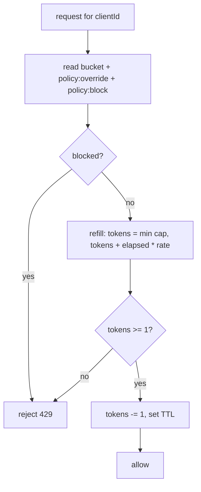

# Rate limiter

A standalone, Redis-backed token-bucket limiter embedded in Spring Cloud Gateway. It is the only
component on the request hot path and has **no dependency on the AI** (architectural rule 1).

## Token bucket

Each client has a bucket `rl:bucket:{default}:{clientId}` holding `tokens` and `timestamp`. One Lua
invocation does the whole decision atomically against Redis server time:

Doing it in one Lua script makes refill-and-consume atomic, so multiple gateway instances share
exactly one bucket with no race. The script also reads `policy:override:{clientId}` (a dynamic
per-client limit) and `policy:block:{clientId}` (a temporary block) so a change takes effect on the
very next request — and if every higher layer is down, the limiter still runs on its static
defaults.

## Namespaces

- `rl:bucket:{default}:{clientId}` — token bucket state.
- `policy:override:{clientId}` — dynamic capacity/refill (set only via the Policy Gate).
- `policy:block:{clientId}` — temporary block with TTL.
- `metric:*` — traffic metrics (Phase 2), separate from `rl:*`.
- `agent:enabled` — the kill switch.

Hash tags `{clientId}` keep a client's keys co-located in Redis Cluster.

## Configuration

Environment variables (see `.env.example`): `RATE_LIMIT_ENABLED`, `RATE_LIMIT_DEFAULT_CAPACITY`
(100), `RATE_LIMIT_DEFAULT_REFILL_RATE` (10/s), `RATE_LIMIT_IDENTIFIER_TYPE` (IP),
`RATE_LIMIT_REDIS_FAILURE_MODE` (`FAIL_OPEN` / `FAIL_CLOSED`), `DOWNSTREAM_URL`.

## Failure modes

| Failure | Behaviour |
|---|---|
| Redis unreachable | `FAIL_OPEN` → allow (availability) or `FAIL_CLOSED` → 429 (safety), per config. |
| Agent down | No effect — limiting continues on the current static/override policy. |
| Metrics write fails | Ignored (fire-and-forget); the rate-limit decision is unaffected. |
| Bad/garbage policy override | Gate validation prevents writing out-of-bounds overrides. |

## Metrics exposed

Actuator `/actuator/prometheus`: `rate_limit_requests_total`, `rate_limit_allowed_total`,
`rate_limit_rejected_total`, `rate_limit_redis_errors_total`, `rate_limit_latency`. Tags are bounded
to policy + result to avoid high-cardinality explosion; per-client detail lives in the aggregated
Redis traffic metrics.
