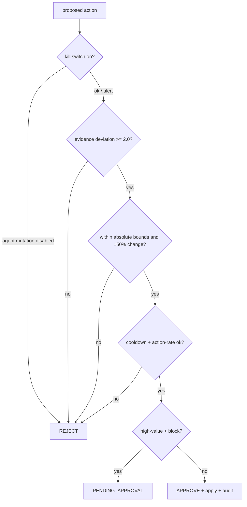

# Security model

The design separates four kinds of traffic and funnels every configuration change through one
validated, audited path (§34, §41).

## Roles and surfaces (§34)

| Surface | Auth | Who |
|---|---|---|
| `/api/**`, `/actuator/health` | public | normal API traffic |
| `/admin/**` | HTTP Basic, **ADMIN** role | human operators |
| `/agent/actions`, `/agent/**` reads | HTTP Basic, **AGENT** role | the AI agent |
| Policy Gate | internal | the only path to mutate policy |

The agent cannot call any `/admin/**` endpoint and cannot reach Redis — it can only read context and
`POST /agent/actions`, which always goes through the gate.

## The Policy Gate (§20–24)

The only actions are `ADJUST_LIMIT`, `TEMPORARY_BLOCK`, `ALERT`. Human admin actions share the same
path and audit but may exceed the agent-only ±50 % cap. Nothing reaches Redis except through the
gate.

## Kill switch (§9, rule 9)

`agent:enabled` in Redis, toggled via `POST /admin/agent/kill-switch`. When off, agent **mutations**
are rejected (alerts still flow); the rate limiter keeps working on the static policy.

## High-value approval (rule 6)

A `TEMPORARY_BLOCK` of a `HIGH_VALUE` client is never executed automatically — it is held as
`PENDING_APPROVAL` in a queue (`GET /admin/agent/pending`, `.../approve`, `.../reject`) until a human
decides.

## Audit (§25)

Every attempt — approved, rejected, or pending — is recorded in Redis (`audit:{clientId}`,
`audit:all`) with trigger, evidence, proposal, gate decision, previous vs applied values (for
rollback), and execution result. A concise rationale is stored, never model chain-of-thought.

## Secrets

Default `admin/admin` and `agent/agent` credentials are **dev-only placeholders** — override via env
(`ADMIN_USERNAME`/`ADMIN_PASSWORD`, `AGENT_USERNAME`/`AGENT_PASSWORD`) in any real deployment. No real
secrets are committed; `.env` is git-ignored. `ANTHROPIC_API_KEY` is supplied via env and, when
absent, the agent runs on the deterministic planner.
